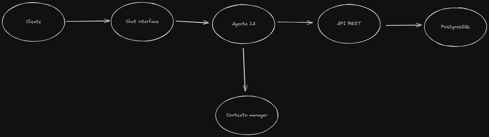

## Disenio de Agente

# Mapa de flujo

[link al mapa de flujo](https://www.mermaidchart.com/app/projects/d89ed055-e1dd-4597-a952-c53afe5a0a56/diagrams/994d0fd1-897b-488d-ae3d-1b955949f6f3/version/v0.1/edit)

# Arquitectura de alto nivel
Componentes Principales

- Frontend/Interface

    Chat Web: Interface principal para interacción
    WhatsApp API (Extra): Canal alternativo de comunicación

- Capa de IA

    LLM (Gemini/OpenAI): Procesamiento de lenguaje natural
    Function Calling: Mapeo de intenciones a llamadas API
    Context Manager: Mantiene estado de conversación y carrito

- Backend API

    API REST: Endpoints para productos y carritos
    Middleware: Validación y manejo de errores
    Business Logic: Lógica de negocio para carritos

- Base de Datos

    PostgreSQL: Almacenamiento persistente
    ORM/Query Builder: Abstracción de base de datos

# Flujo de datos

